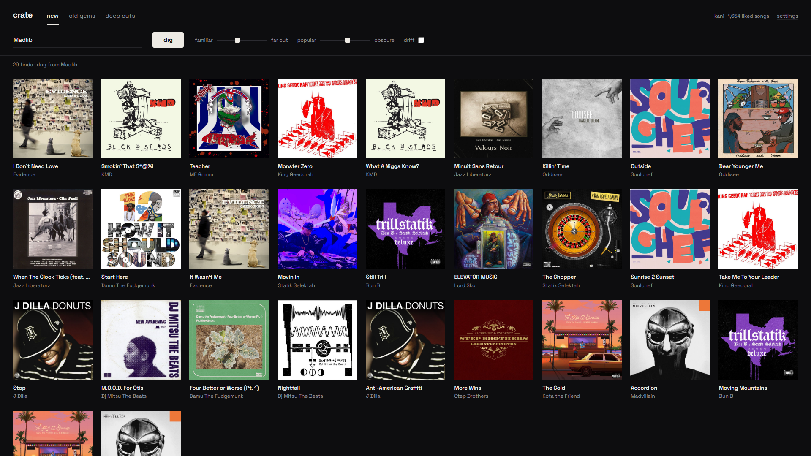

# crate

Local music discovery that digs instead of pushing. Your Spotify library is the
taste profile; the recommendations come from open similarity graphs (Deezer,
optionally Last.fm) — not from Spotify's promo pipeline. Runs entirely on your
machine at `http://127.0.0.1:8823`.

Why not just use Spotify's recommendations API? Because it's gone — Spotify
removed `/recommendations`, related-artists, and audio-features for all new
apps in November 2024. crate treats Spotify as a dumb library (read likes,
save finds back) and gets everything else elsewhere.

## Run

Double-click `crate.vbs` (hidden console) or `start.cmd` (visible console).
Needs Node, no npm install.

## One-time setup (~3 minutes)

1. Open <https://developer.spotify.com/dashboard>, log in with your normal
   Spotify account, hit **Create app**.
2. Name/description: anything. **Redirect URI**: `http://127.0.0.1:8823/callback`
   (must be exactly this — Spotify requires the 127.0.0.1 form, not localhost).
   Tick **Web API**. Save.
3. Copy the **Client ID** from the app's settings page into crate's settings
   panel, save, then **Connect Spotify**.

First connect scans your Liked Songs (a few minutes if you have thousands;
incremental afterwards) plus your top artists, and stores the profile locally.
No other accounts or services involved — just your Spotify and open data.

## Use

- **Dig** — fills the grid with finds, one artist per tile, never two cuts
  off the same album. Blank seed = sampled from your taste; or type any artist.
- **Lanes** — your library is clustered into taste lanes (rap, electronic,
  indie, …) from real genre data; click one to dig only that side of you.
- **Modes**: *New* (artists you don't know, mid-catalog — not their hits),
  *Old gems* (year-capped album digs, oldest-first bias), *Deep cuts* (non-hit
  album tracks from artists you already love).
- **Dials**: familiar↔far out (graph-walk distance — always at least two hops
  out), popular↔obscure (fan-count / rank caps — push right to leave the
  mainstream entirely).
- **⤵ on any tile tunnels from that exact track** — a dig seeded from its
  maker's corner of the graph. Hover a tile to see *why* it's there (via which
  seed → branch).
- Click a cover for the 30s preview. **Drift** chains onward through the same
  branch of the graph and re-digs from wherever it drifted when the crate runs
  low — a shuffle that actually goes somewhere. **queue** sends the full track
  to whatever Spotify is playing on (Premium).
- **♥** saves to Liked Songs + a playlist of your choosing (settings: the
  auto *Crate finds*, any playlist you own, or likes only) and feeds the
  profile. **✕** bans a track forever — and repeated bans of an artist bury
  that whole branch of the graph. Only tracks you've actually seen or heard
  go into the 14-day no-repeat window.
- **Profile** (top right): the shape of your library — lanes, most-dug
  artists, its vintage — plus the log of every find with open-in-Spotify
  links, and **bottle into a playlist**: turn your recent finds into a fresh
  named playlist in one click.
- Keys: `space` pause · `n`/`p` next/prev · `l` love · `x` ban · `d` tunnel ·
  `q` queue.

## Files

- `server.js` — zero-dep local server: static UI, Deezer/Last.fm proxy
  (throttled + cached), store persistence. Binds 127.0.0.1 only.
- `public/engine.js` — the discovery engine (graph walk, filtering, scoring).
- `public/app.js` — Spotify PKCE auth, library scan, UI.
- `data/store.json` — your profile, seen/banned/saved log, tokens. Local only;
  delete it to reset everything.
- `check.mjs` — `npm run check`: live end-to-end engine test, no Spotify needed.

Personal-use app (Spotify "development mode", your account only). Tracks that
exist on Deezer but not Spotify are kept in a local log instead of being lost.

---

Built by [Sean Kani](https://seankani.com).
